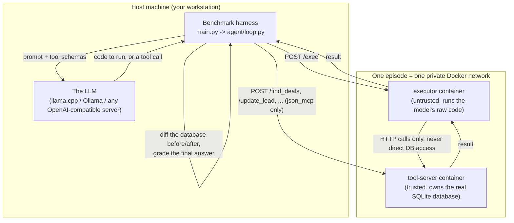
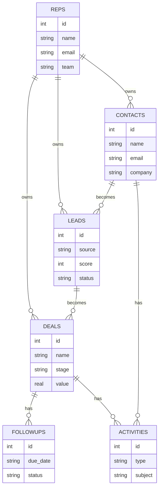
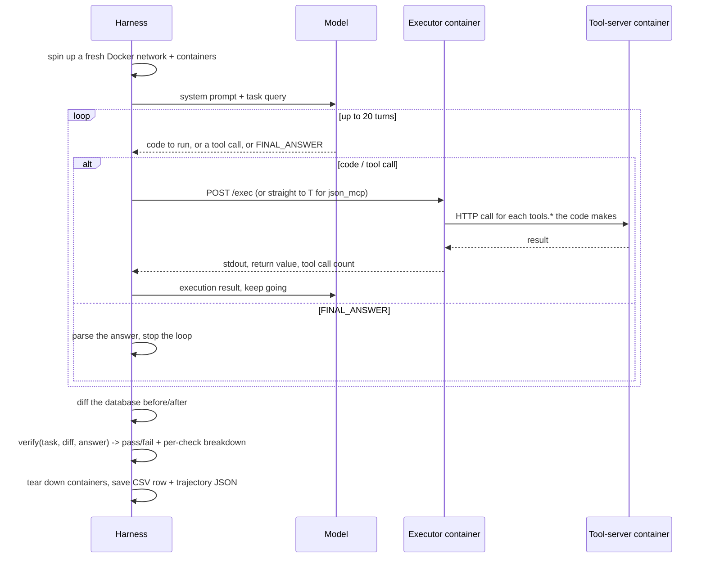

# Ent-Agent-Bench

A benchmark that answers one question: when an LLM agent needs to use tools, is it better off **writing code** that calls those tools, or **emitting structured JSON tool calls** the way most agent frameworks do today?

It runs the same tasks against the same simulated CRM through four different "surfaces" (Python code, JavaScript code, TypeScript code, and JSON/MCP-style structured calls) and grades every attempt the same way, so the four surfaces are directly comparable, model for model, task for task.

This document explains the whole system: the scenario, how tasks are generated, how an episode actually runs, how it's graded, and how to run it yourself.

---

## Contents

1. [Why this exists](#why-this-exists)
2. [The big picture](#the-big-picture)
3. [The CRM scenario](#the-crm-scenario)
4. [The four surfaces](#the-four-surfaces)
5. [How a task is generated](#how-a-task-is-generated)
6. [How one episode runs](#how-one-episode-runs)
7. [How an episode is graded](#how-an-episode-is-graded)
8. [The model registry](#the-model-registry)
9. [Configuration](#configuration)
10. [Running the benchmark](#running-the-benchmark)
11. [Output layout](#output-layout)
12. [Testing and validation](#testing-and-validation)
13. [Project layout](#project-layout)
14. [Known limitations](#known-limitations)

---

## Why this exists

Most agent benchmarks test tool use through a fixed structured-calling protocol: the model is given a list of function schemas, and it responds with a JSON object naming a function and its arguments. That is one way to call a tool. It is not the only way.

A model that can write code can also call tools directly from that code  loop over results, filter them, batch several calls together, compute a value inline  all inside one turn, instead of one call per turn. Whether that actually helps, on real multi-step tasks, is an empirical question this benchmark is built to answer.

So every task in this benchmark is run through both styles against the identical scenario, the identical data, and the identical grading logic. The only thing that changes is how the model is allowed to act.

---

## The big picture



Three things are deliberately separated:

- **The model** never touches the database. It only ever sees tool descriptions and gets JSON results back.
- **The executor container** (where the model's Python/JS/TS code actually runs) has zero filesystem access to the database or any scenario code  it can only reach data by making an HTTP call to the tool-server, exactly like the model would if it were calling tools directly. This means code-mode isn't secretly cheating by reading the database file directly; it has the exact same access as JSON/MCP mode.
- **The tool-server** is the only thing that ever executes real SQL. It is the same container regardless of which surface is under test.

Every episode gets its own fresh Docker network, its own copy of the world database, and is torn down completely afterward. Nothing persists between episodes.

---

## The CRM scenario

The simulated world is a small CRM: sales reps manage contacts, who become leads, who become deals, with activities (calls, emails, meetings, notes) and follow-ups scheduled along the way.



The whole world runs on a **frozen simulation clock** (`SIM_TODAY`, currently `2026-06-01`), so "overdue" and "in the next 30 days" mean the same thing every time the benchmark runs  no flaky, date-dependent tasks.

Every table has a matching tool: `find_contacts`, `get_deal`, `update_lead`, `schedule_followup`, `log_activity`, and so on  17 tools in total, defined once in `src/tool_server/models.py` and served over HTTP by `src/tool_server/server.py`.

---

## The four surfaces

| Surface | The model... | Interaction mode |
|---|---|---|
| `python` | writes Python code with a `tools` object in scope | `tool_call` (structured `execute(code, lang)` call) or `text_block` (fenced code block in plain text) |
| `js` | writes JavaScript, same convention | same as above |
| `ts` | writes TypeScript  actually type-checked before running (see below) | same as above |
| `json_mcp` | calls each of the 17 CRM tools directly as structured function calls, no code at all | `tool_call` only |

Two axes, so a model can be tested four different ways per task: which language it writes (or `json_mcp` for no code at all), and whether it uses the API's native structured tool-calling feature (`tool_call`) or has to write plain text with a `FINAL_ANSWER` marker instead (`text_block`, used automatically for models that don't support tool calling).

The TypeScript surface is the most interesting technically: it doesn't just strip type annotations, it runs a real TypeScript compiler pass (`ts.createProgram`) against the model's code with the actual hand-written tool signatures (`tools.d.ts`) as an ambient declaration file. A model that calls `tools.update_deal({stage: 123})` (wrong type) gets caught by the type-checker before the code ever runs  the same way a human developer would find that mistake, rather than as a runtime 422 from the server.

---

## How a task is generated

Tasks are not random  they are built to be true. The generator decides the task first, then constructs a world that makes it correct **by design**, rather than generating a random world and hoping a valid task exists in it.

```mermaid
flowchart LR
    A["1. Pick a template\n(e.g. \"mark this overdue\nfollow-up as done\")"] --> B["2. Draw parameters\n(company name, dates,\nwhich action)"]
    B --> C["3. Build the kernel\n(the exact rows needed\nto make the task valid)"]
    C --> D["4. Build background noise\n(60 contacts, 40 leads, 35 deals...\nsame distributions, but excluded\nfrom matching the kernel)"]
    D --> E["5. Interleave kernel + noise\ninto random id positions,\nwrite the SQLite file"]
    E --> F["6. Compute the expected\ndiff and the ground truth\nanswer from the kernel alone"]
    F --> G["7. Audit: re-derive every\ninvariant empirically against\nthe finished artifact"]
```

Concretely, for a task like *"Our overdue follow-up on the Soylent deal needs attention: mark it as done. Give me the id as followup_id"*:

1. The template (`templates/easy/act_on_a_followup.yaml`) declares that this task needs one contact, one lead, one deal, and one follow-up planted with a due date in the past and status `open`.
2. A company name, contact name, and due date get drawn from seeded random pools.
3. Those four rows are built as the **kernel**  the exact entities the task is about.
4. Sixty background contacts, forty leads, thirty-five deals, and so on are generated with the same statistical shape, but the kernel's company name and contact name are explicitly excluded from the background draw pools, so nothing in the noise can accidentally also match "the Soylent deal."
5. Kernel rows and background rows get shuffled together and assigned ids uniformly across the table's id range  the answer is never suspiciously "the row with the highest id," which would let a model (or a human) shortcut the task without actually reading it.
6. The expected database diff (`followups.status: open -> done`) and the ground truth answer (`followup_id: <the kernel row's id>`) are computed directly from the kernel  no need to re-query the world to figure out what "correct" means.
7. A battery of invariant checks (`src/db/scenarios/crm_scenario/tasks/audit.py`) re-verifies the finished artifact from scratch: does the golden solution actually pass `verify()`? Is the entity description unique? Are there any near-ties that would make "over $50,000" ambiguous? A separate script (`cheater.py`) tries to guess the answer using only dumb shortcuts (highest id, most recently created) with no access to the query at all  if it starts guessing right more often than chance, that means something in construction is leaking a fingerprint, and the corpus fails its own regression test.

Every task is generated from a seed (`SEED_BASE` plus an index), so the exact same corpus can be regenerated byte-for-byte at any time via `python3 main.py generate-tasks`. Tasks and their worlds are frozen once as JSON + SQLite pairs (`src/db/scenarios/crm_scenario/tasks/frozen/<tier>/task_XXX.{json,sqlite}`) and never rebuilt at episode time, so reproducibility never depends on generator code staying unchanged.

There are four difficulty tiers  **easy** (one lookup, one action), **medium** and **hard** (more hops, distractor entities), and **expert** (iteration over a group, per-item branching, multi-hop chained lookups, or data-dependent conditional logic)  each with its own set of templates.

---

## How one episode runs



A few details worth knowing:

- **The turn budget is a flat 20 turns for every surface, on every task.** This was a deliberate fairness decision: code-mode can batch many tool calls into a single `execute()` turn, while `json_mcp` needs roughly one turn per tool call with no batching. A budget derived from "how many tool calls does this task need" would silently hand code-mode much more slack on the same task. A fixed budget keeps the comparison fair  if `json_mcp` runs out of room on a hard multi-action task, that's a real, comparable finding (recorded as `hit_turn_budget`), not an artifact of how the budget was computed.
- **Errors are categorized into three tiers**, each independently trackable in the output: `infra_error` (Docker/container setup itself failed  not the model's fault), `model_api_error` (the call to the model API failed  context overflow, rate limit, malformed request), and `episode_error` (anything else unexpected inside the turn loop  an executor container that died mid-run, a tool-server network blip). None of these ever crash the batch run; a bad episode is graded as a clean failure and the run continues to the next one.
- **Transient container connectivity issues are retried** (up to three attempts with backoff) before being recorded as a failure  a momentary Docker networking hiccup shouldn't cost an otherwise-working model a whole episode. A genuine non-2xx response from a live container is never retried, since that's an application error a retry wouldn't fix.
- **The Python, JS, and TS executors all enforce an execution timeout** so a model's infinite loop can't hang a container indefinitely.
- Every trajectory (every model turn, every tool call and its result, the final answer, the full verify breakdown) is saved as its own JSON file, written atomically so a crash mid-write can never leave a corrupted file behind.

---

## How an episode is graded

Grading never looks at *how* the model got there  only at what actually changed in the database and what it reported as the final answer. `src/verifier/verify.py` runs six independent checks:

| Check | What it verifies |
|---|---|
| `answer` | Every field the task asked for is present and matches the ground truth (type-tolerant: `"5"` matches `5`) |
| `expected_added` | Every row the task expected to be created actually was |
| `exact_added_count` | Exactly that many rows were added  not more |
| `expected_changed` | Every row the task expected to be modified actually was, with the right field values |
| `exact_changed_count` | Exactly that many rows were modified  not more |
| `forbidden` | Nothing outside what the task explicitly allowed was touched (this is what catches a model updating the wrong row, or creating a duplicate record instead of finding the existing one) |

`passed` is true only if all six hold. `fulfillment_score` (the fraction of the six that passed) gives a partial-credit view for analysis even on a failed episode.

---

## The model registry

`models.yaml` is the single source of truth for which models exist and how to reach them. Every entry:

```yaml
- name: gemma4-12b-llamacpp-local
  backend: openai_compatible
  model_id: unsloth/gemma-4-12b-it-GGUF:gemma-4-12b-it-BF16.gguf
  base_url: http://localhost:8083/v1
  api_key_env: null
  supports_tool_calling: true
```

`backend: openai_compatible` covers any server that speaks the standard `/v1/chat/completions` protocol  llama.cpp, Ollama, vLLM, OpenAI itself. `model_id` doubles as the exact `--hf-repo:--hf-file` pair `llama-server` needs to download and serve that model. `supports_tool_calling` controls whether the harness defaults that model to `tool_call` mode or falls back to `text_block`  set to `false` for any model where structured tool-calling was tested and found broken on the serving setup in use, so it never silently wastes its whole turn budget retrying a mode that can't work.

The current fleet, all served locally through llama.cpp, no quantization except where the model genuinely doesn't fit in VRAM otherwise:

| Model | Size | Precision |
|---|---|---|
| Gemma-4-12B | 12B | BF16 |
| Qwen2.5-14B-Instruct | 14B | F16 |
| GPT-OSS-20B | 20B | MXFP4 (native release format  OpenAI never shipped a higher-precision version) |
| Gemma-4-26B-A4B | 26B (4B active, MoE) | BF16 |
| Qwen3-Coder-30B-A3B | 30B (3B active, MoE) | BF16 |
| Gemma-4-31B | 31B | BF16 |
| Qwen2.5-72B-Instruct | 72B | Q8_0 (deliberate exception  F16 would exceed available VRAM) |

Every entry's exact filename was individually confirmed against the model's real HuggingFace file listing before being added  GGUF repos frequently don't ship the precision or file layout you'd assume from the model name alone.

---

## Configuration

Every tunable knob in the harness lives in one place: `config.py` at the repo root. There are no secrets in it  API keys are referenced by environment variable name in `models.yaml` (`api_key_env`), never written into any committed file  so `config.py` is meant to be read, edited, and shared through the repo like any other source file.

It covers four areas: the agent loop's turn budget and retry/timeout values, Docker orchestration's container-readiness timeouts and image names, task generation's seed base and background row counts, and the CLI's default flag values. Each consuming module imports directly from it rather than hardcoding its own copy.

---

## Running the benchmark

### Generate the task corpus

```bash
python3 main.py generate-tasks                     # 30 tasks per tier, the default seed
python3 main.py generate-tasks --n-per-tier 50      # more tasks
python3 main.py generate-tasks --seed-base 5000     # a different (still fully reproducible) corpus
```

### Run it against one model

```bash
python3 main.py run --models gemma4-12b-llamacpp-local --difficulty easy --limit 2
```

`--models` accepts a comma-separated list to run several models in one invocation. `--surfaces` and `--interaction-modes` narrow which surfaces/modes run (default: all four surfaces, `tool_call` or `text_block` chosen automatically per model). `--difficulty` selects a tier or `all`. `--limit` caps how many tasks per tier, useful for a quick smoke test before committing to a full run.

### Run the full benchmark against every model, unattended

```bash
./run_full_benchmark.sh          # every model in models.yaml, every difficulty tier
./run_full_benchmark.sh easy     # restrict to one tier
```

This script starts each model's `llama-server` in turn, waits until it actually responds (polling, not a fixed sleep  a 12B model and a 72B model do not load in the same amount of time), runs the full benchmark against it, stops that server, and only then moves to the next model. It never runs two models at once, since several of these are close to the workstation's VRAM ceiling individually.

---

## Output layout

Every run produces a CSV (one row per episode) and a folder of trajectory JSON files (one per episode, the full turn-by-turn transcript), both living under matching names derived from `--out`:

```
results/
  gemma4-12b-llamacpp-local/
    gemma4-12b-llamacpp-local.csv
    llama-server.log
    gemma4-12b-llamacpp-local/
        a1b2c3d4.json
        e5f6a7b8.json
        ...
```

The CSV's columns cover identity (`model`, `surface`, `interaction_mode`, `task_id`, `difficulty`), outcome (`passed`, `answer_correct`, `db_correct`, `fulfillment_score`), efficiency (`tool_calls_made`, `model_turns`, latency and token columns), error breakdown (`tool_error_count`, `syntax_error_count`, `type_error_count`, `runtime_error_count`, `parse_error_count`, `recovered`), and the three infra-level error flags described above. The CSV is written and flushed after every single episode, so a crash or an interrupted run always leaves a valid, readable partial file  never a truncated one.

---

## Testing and validation

```bash
python3 -m pytest -q                                          # the unit test suite
python3 -m src.db.scenarios.crm_scenario.tasks.audit           # re-verify every invariant over the frozen corpus
python3 -m src.db.scenarios.crm_scenario.tasks.cheater         # leakage/guessing-floor baseline
```

The audit re-derives every correctness invariant empirically against the actual frozen artifacts (not just the generator code) every time it runs: does the golden solution really pass `verify()`? Is every task's target entity actually unique in its world? Are anchor ids spread across the id range rather than clustered where naive injection would put them? Does rebuilding a task from its own seed reproduce the exact same artifact (proving the generator and the frozen corpus haven't drifted apart)? The cheater baseline runs alongside it as a permanent regression test  its accuracy should stay near chance; a jump would mean the corpus has started leaking a detectable fingerprint.

---

## Project layout

```
main.py                     entrypoint: run episodes, or generate the task corpus
cli.py                      argument parsing
config.py                   every tunable value the harness uses
models.yaml                 the model registry
run_full_benchmark.sh       run every model in the registry, unattended

src/agent/
  loop.py                   the actual per-episode orchestration
  prompts.py                builds the system prompt + tool schemas per surface
  trajectory.py             records and saves the full turn-by-turn transcript
  final_answer.py           parses a text_block FINAL_ANSWER turn
  tools.json                the JSON tool schema for structured (tool_call) modes
  tools_python.pyi          tools reference shown to the model in Python code-mode
  tools_js.js                tools reference shown to the model in JS code-mode

src/docker_runner/
  episode.py                per-episode Docker orchestration: network, containers, exec(), teardown

src/executors/
  python_executor/          the untrusted Python sandbox (Flask + a REPL-style exec)
  js_executor/               the untrusted JS sandbox (Node vm module)
  ts_executor/               the untrusted TS sandbox  real semantic type-checking before running

src/tool_server/
  server.py                  the 17 CRM tool routes (FastAPI)
  models.py                  the Pydantic request schema per tool  the source of truth for the tool catalog
  services.py                 one function per tool: calls the real implementation, converts errors

src/db/
  db.py                       scenario-agnostic snapshot/diff helpers
  scenarios/crm_scenario/
    crm_db.py                 the CRM schema
    crm_tools.py               the real tool implementations (the actual SQL)
    pools.py                   shared random-draw helpers (names, companies, dates, ...)
    tasks/
      template_interpreter.py  the YAML task-template DSL
      world_builder.py         constructive world generation
      build_tasks.py           freezes the task corpus to disk
      audit.py                 re-verifies every invariant over the frozen corpus
      cheater.py                leakage/guessing-floor measurement
      templates/                the task templates themselves, one YAML file per template per tier

src/verifier/verify.py       grades one finished episode against its frozen task
src/meter/meter.py           per-episode metrics collection -> one CSV row
src/llm_clients/
  client.py                   one class per backend (OpenAI-compatible, Anthropic)
  registry.py                  loads models.yaml into typed config objects
src/core/errors.py            the domain error vocabulary every tool implementation raises

src/tests/                    the pytest suite
docker/                       one Dockerfile per container (tool-server + 3 executors)
```

---

## Known limitations

- **Anthropic's native tool-use wire format isn't translated on the way in.** `AnthropicClient` correctly normalizes *responses* into the harness's internal shape, but the multi-turn message-building in `loop.py` (assistant `tool_calls`, `role="tool"` results) is written for the OpenAI wire format. This has never been exercised against a real Anthropic model in this environment.
- **No automated regression tests exist yet for `run_episode()`, the Docker retry logic, or the trajectory atomic-write behavior.** All three were verified manually against real Docker and real models during development, but a future change to any of them would not be caught by `pytest` alone.
- **The executor containers' outbound internet access is not currently blocked.** The trust boundary that *is* fully enforced  no filesystem access to the database or scenario code holds regardless, but true network egress isolation would need a different mechanism (a proxy container, or per-container firewall rules) not yet built.
